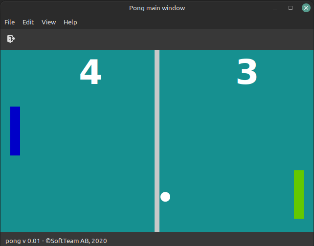

# PONG

A simple GTK version of the game pong written in Go.

## LINKS

* Inspiration came from Tech With Tim's video : https://www.youtube.com/watch?v=vVGTZlnnX3U

## SCREENSHOT

## TODO

* BUG : The code currently does not detect key presses correctly
* TODO : No winning score is set